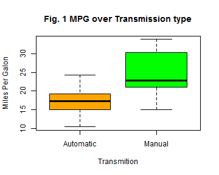
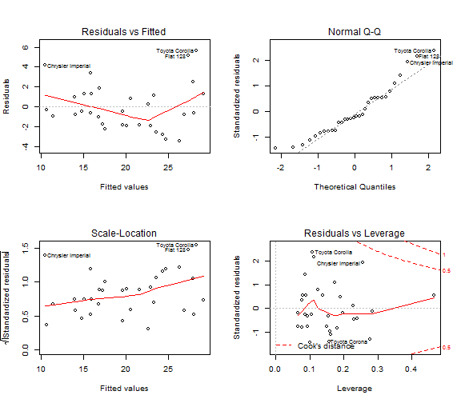

## Is manual transmission trully more economic in fuell comsumption?
========================================================

### 1. Executive Summary
It is a widely spread belief that manual transmission cars behave better than automatic ones, as far as fuell consumption is concerned. People often believe that changing gears manually results in better fuel management and that automatic transmission cars, although easier to drive, tend to have lower miles per galon productivity.

The scope of this paper is to answer two major questions in regards to this belief:
  -Is automatic or manual transmission better for MPG?
  -How different is the MPG between cars with automatic and manual transmissions?

Our analysis will be based on the MTCARS (Motor Trend Car Road Tests) R dataset. The MTCARS data was extracted from the 1974 Motor Trend US magazine, and comprises fuel consumption and 10 aspects of automobile design and performance for 32 automobiles (1973–74 models). 

As we will see, although manual transmission cars in general do have higher MPG, yet, the MPG difference with the automatic ones may vary considerably, strongly affected by other characteristics like the cylinders of the engine or the total car weight. 

### 2. Exploratory analysis and inference
The answer to the first question comes easily from just inspecting a simple boxplot (Fig. 1) of the Miles Per Gallon over the type of transmission. We may easily see that manual transmission cars have significantly higher average MPG than automatic transmission cars.

 

This may be verified by some inference analysis using a **T** test:

```
## 
## 	Welch Two Sample t-test
## 
## data:  mpg by am
## t = -3.767, df = 18.33, p-value = 0.001374
## alternative hypothesis: true difference in means is not equal to 0
## 95 percent confidence interval:
##  -11.28  -3.21
## sample estimates:
## mean in group 0 mean in group 1 
##           17.15           24.39
```

As we see, the mean MPG for the manual transmission cars (group 1) is **24.3923**, about **7.2449** higher than that of the automatic cars (group 0).

### 3. Regression Analysis.
In order to quantify the difference in the MPG between automatic and manual transmission cars, we will use linear regression analysis. First we shall create a simple linear model of *MPG* and *AM*. 

```r
simple_model <- lm(mpg ~ am, data = mtcars)
summary(simple_model)
```

```
## 
## Call:
## lm(formula = mpg ~ am, data = mtcars)
## 
## Residuals:
##    Min     1Q Median     3Q    Max 
## -9.392 -3.092 -0.297  3.244  9.508 
## 
## Coefficients:
##             Estimate Std. Error t value Pr(>|t|)    
## (Intercept)    17.15       1.12   15.25  1.1e-15 ***
## am              7.24       1.76    4.11  0.00029 ***
## ---
## Signif. codes:  0 '***' 0.001 '**' 0.01 '*' 0.05 '.' 0.1 ' ' 1
## 
## Residual standard error: 4.9 on 30 degrees of freedom
## Multiple R-squared:  0.36,	Adjusted R-squared:  0.338 
## F-statistic: 16.9 on 1 and 30 DF,  p-value: 0.000285
```

This model does not offer us any additional information than that of the T test. The **Intercept** (17.1474) represents the mean MPG for automatic cars, while the **AM coefficient**  (7.2449), is the difference between the MPG of manual and automatic transmission cars, which matche exactly the results the T test produced. We therefore conclude that the *MPG* is affected by additional variables. In order to determine these variables we shall examine the correlation between the MPG and the rest of the variables.

```r
sort(cor(mtcars)[1, ])
```

```
##      wt     cyl    disp      hp    carb    qsec    gear      am      vs 
## -0.8677 -0.8522 -0.8476 -0.7762 -0.5509  0.4187  0.4803  0.5998  0.6640 
##    drat     mpg 
##  0.6812  1.0000
```

We see that the top varialbles related to *MPG* are: Wheight (wt), Number of Cylinders (cyl), Engine Displacement (disp) and Horse Power (hp), with conciderable differenece to the rest of the variables (keep in mind that in correlation, low negative numbers are as important as high positive ones). However, displacement is strongly related to the number of cylinders, so we shall include only the "wt","cyl"and "hp"" variables in a new model that we shall create and compare to the simple MPG~AM model.

```r
new_model <- lm(mpg ~ wt + cyl + hp + am, data = mtcars)
best_model <- anova(simple_model, new_model)
print(best_model)
```

```
## Analysis of Variance Table
## 
## Model 1: mpg ~ am
## Model 2: mpg ~ wt + cyl + hp + am
##   Res.Df RSS Df Sum of Sq    F  Pr(>F)    
## 1     30 721                              
## 2     27 170  3       551 29.2 1.3e-08 ***
## ---
## Signif. codes:  0 '***' 0.001 '**' 0.01 '*' 0.05 '.' 0.1 ' ' 1
```

The comparison shows a very small ***p-value*** of 1.2742 &times; 10<sup>-8</sup>, which allows us to reject the **Null Hypothesis** that the simple model may explain the *MPG* variable better, and thus opt for the multivariable model.

### 4. Examine the residuals
Before concluding, we should examine the residuals plot.

```r
par(mfrow = c(2, 2))
plot(new_model)
```

 

Generaly we cannot notice anything extremely pequliar. The *Normal Q-Q* plot shows that the residuals are normaly distributed and the *Residuals vs Fitted* and *Scale Location* plots do not show any specific patterns. We may notice some outliers in the *Residuals vs Leverage* plot, but these are well within the Cook\'s Distance limits, so even if we removed them it would not change our model significantly.

### 5. Conclusion
Lastly, we shall analyse the new multivariable model to see how MPG is affected by each variable.

```r
summary(new_model)
```

```
## 
## Call:
## lm(formula = mpg ~ wt + cyl + hp + am, data = mtcars)
## 
## Residuals:
##    Min     1Q Median     3Q    Max 
## -3.476 -1.847 -0.554  1.276  5.661 
## 
## Coefficients:
##             Estimate Std. Error t value Pr(>|t|)    
## (Intercept)  36.1465     3.1048   11.64  4.9e-12 ***
## wt           -2.6065     0.9198   -2.83   0.0086 ** 
## cyl          -0.7452     0.5828   -1.28   0.2119    
## hp           -0.0250     0.0136   -1.83   0.0786 .  
## am            1.4780     1.4411    1.03   0.3142    
## ---
## Signif. codes:  0 '***' 0.001 '**' 0.01 '*' 0.05 '.' 0.1 ' ' 1
## 
## Residual standard error: 2.51 on 27 degrees of freedom
## Multiple R-squared:  0.849,	Adjusted R-squared:  0.827 
## F-statistic:   38 on 4 and 27 DF,  p-value: 1.02e-10
```

First of all the *R-squared* is 0.849, indicating that a great part of the variance is explained by this model. 
According to the model, weight and number of cylinders have a negative effect on mileage. Specifically,

  - The *MPG* of a car decreases by **-2.6065** for every **1000lbs** of extra weight.
  - Each extra cylinder decreases the *MPG* by a factor of **-0.7452**.
  - The car's HP does not affect consumption dramatically.
  - Generally, cars with manual transmission, tend to produce **1.478** times more *miles per gallon*, compared with automatic transmission cars with the same weight, cylinders and horsepower.
